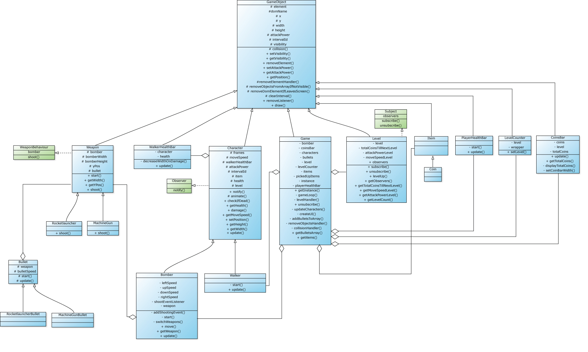

# Typescript shooter

Within this game I implemented the following design patterns:

- Singleton
- Strategy pattern
- Observer pattern
- Polymorphism

# Installation

1.  Git clone project
2.  Open index.html
3.  Play game

# Demo

[Link to demo](https://musing-saha-22f8b5.netlify.com/docs/ "Take a look!")

# UML



# Pull request

Within this pull request I added the functionality where enemies are created at a random position on the screen. I made use of inheritance and composition.

[Link to pull request](https://github.com/Fabiantjoeaon/programmeren-4-game/pull/1 "Take a look!")

# Peer review

[Link to peer review](https://github.com/Fabiantjoeaon/programmeren-4-game/issues/2 "Take a look!")

# Singleton

NOTE: All the code snippets used in this readme file are abstracted versions of the real implementation.

I used the Singleton pattern to create a game object. Why?..

- There can only be one game.
- This way I can call the game object in my entire game.

```javascript
class Game extends GameObject {
  private static instance: Game;

  private constructor() {}

  public static getInstance() {
    if (!Game.instance) {
      Game.instance = new Game();
    }
    return Game.instance;
  }
}

// This way I have access to the game intance in the entire game.
Game.getInstance();
```

# Polymorfisme

Every character in the game is added to the characters array. Since all these characters extend from the Character class I can call 'character.update()' on every one of them. In this example I use an override method in the Bomber and Walker class to give the objects a different behaviour.

```javascript
class Game extends GameObject {
  private characters: Character[] = [];

  private constructor() {
      this.bomber = new Bomber(this.level);
      this.characters.push(this.bomber);
      setInterval(() => {
        this.characters.push(new Walker(this.level));
      }, 2000);
      this.gameLoop();
  }

  private gameLoop(): void {
    this.updateCharacters();
    requestAnimationFrame(() => this.gameLoop());
  }

  private updateCharacters(): void {
    this.characters.forEach(character => {
      character.update();
    });
  }
}
```

Every weapon in this game extends the abstract class Weapon. Within this class I created a shoot method. I use an override method in the Machinegun and Rocketlauncher class to define different behaviour. This way I can call weapon.shoot() no matter what weapon is active.

```javascript
class Bomber extends Character {
  private weapon: Weapon;

  constructor() {
    // Define start weapon
    this.weapon = new MachineGun(this);

    window.addEventListener("keydown", (event: KeyboardEvent) => {
      this.switchWeapons(event);
    });

    this.addShootingEvent();
  }

  private switchWeapons(event: KeyboardEvent): void {
    const firstWeaponKey = 49;
    const secondWeaponKey = 50;
    switch (event.keyCode) {
      case firstWeaponKey:
        this.weapon = new MachineGun(this);
        break;
      case secondWeaponKey:
        this.weapon = new Rocketlauncher(this);
        break;
    }
  }

  private addShootingEvent(): void {
    this.shootEventListener = () => this.weapon.shoot();
    window.addEventListener("click", this.shootEventListener);
  }
}

abstract class Weapon {
    public shoot(): void {}
}

class MachineGun extends Weapon {
  constructor() {
    super();
  }

  public shoot(): void {
    this.bullet = new MachineGunBullet(this);
    Game.getInstance().addBulletsToArray(this.bullet);
  }
}

class Rocketlauncher extends Weapon {
  constructor() {
    super();
  }

  public shoot(): void {
    this.bullet = new RocketlauncherBullet(this);
  }
}
```

# Strategy

In my game there is a possibility to switch between weapons. Every weapon has a different behaviour. I use a strategy pattern to switch between behaviour. This way I can just say:

```javascript
class Bomber extends Character {
  private weapon: Weapon;

  constructor() {
    // Define start weapon
    this.weapon = new MachineGun(this);

    window.addEventListener("keydown", (event: KeyboardEvent) => {
      this.switchWeapons(event);
    });

    this.addShootingEvent();
  }

  private switchWeapons(event: KeyboardEvent): void {
    const firstWeaponKey = 49;
    const secondWeaponKey = 50;
    switch (event.keyCode) {
      case firstWeaponKey:
        this.weapon = new MachineGun(this);
        break;
      case secondWeaponKey:
        this.weapon = new Rocketlauncher(this);
        break;
    }
  }

  private addShootingEvent(): void {
    this.shootEventListener = () => this.weapon.shoot();
    window.addEventListener("click", this.shootEventListener);
  }
}

abstract class Weapon extends GameObject implements WeaponBehaviour {
  public bomber: Bomber;

  constructor(bomber: Bomber) {
    super();
    this.bomber = bomber;
  }

  public shoot(): void {}
}

interface WeaponBehaviour {
  bomber: Bomber;
  shoot(): void;
}

```

# Observer

Every character in the game(zombies and player) observe the Level object. When the collects enough coins for the next level every active character is notified and gets stronger.

```javascript
interface Observer {
  notify(): void;
}

interface Subject {
  observers: Observer[];
  subscribe(observer: Observer): void;
  unsubscribe(observer: Observer): void;
}

class Level extends GameObject implements Subject {
  public subscribe(observer: Observer): void {
    this.observers.push(observer);
  }

  public unsubscribe(): void {
    this.removeObjectsFromArrayIfNotVisible([this.observers]);
  }

  public levelUp() {
    for(const observer of this.observers) {
      observer.notify();
    }
  }
}

class Character extends GameObject implements Observer {
  public notify(): void {
    this.attackPower = this.level.getAttackPowerLevel();
    this.moveSpeed = this.level.getMoveSpeedLevel();
    console.log(this.element, 'is notified');
  }
}
```

# Gameplay componenten

```javascript
* De game heeft levels met een oplopende moeilijkheidsgraad
```
